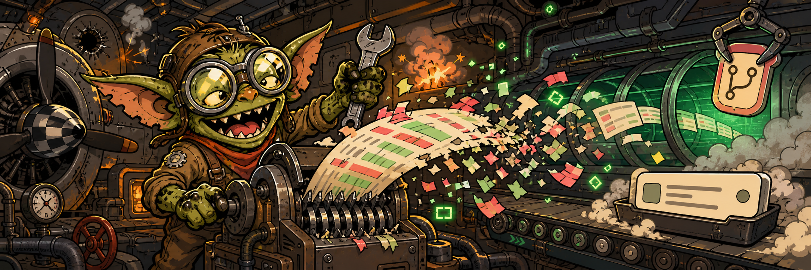

# git-gremlin



> chaotic saboteur / breaks everything except your context

A tamed WWII aviation gremlin, once blamed for every mechanical failure on Allied aircraft, now working exclusively on your git pipeline. It eats your diffs, writes your commit messages, creates your PRs — and your main context never sees a single raw token.

## Skills

| Skill | What it does |
|---|---|
| _none yet — run `scaffold-skill` to add one_ | |

## Agents

| Agent | Used by | Role |
|---|---|---|
| _none yet_ | | |

## Install

```
/plugin marketplace add g-bastianelli/nuthouse
/plugin install git-gremlin@nuthouse
```

Restart Claude Code after install.

## License

MIT
