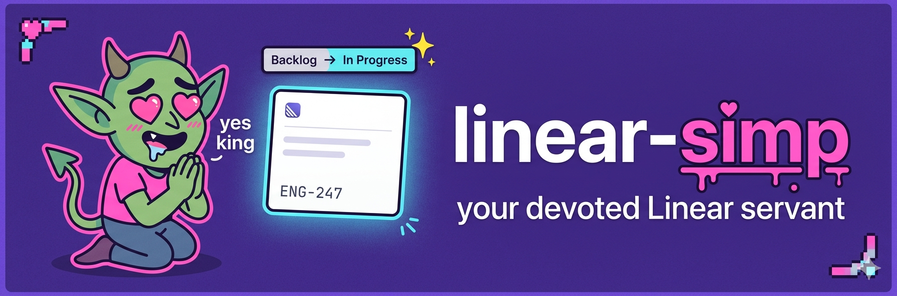

# linear-devotee



Linear workflow plugin for Claude Code and Codex. It detects Linear issues, prepares SDD-formatted context, separates intake from planning, tracks spec drift, and creates Linear projects, milestones, and issues behind explicit mutation gates.

Voice = decorative feral devotee. Normal workflow feedback stays factual; the persona appears as an optional one-line ornament around every user-visible workflow transition.

## Skills

| Skill | What |
|---|---|
| `linear-devotee:greet` | Detects issue from branch or first prompt, delegates issue context to a cheap read-only scout, sets In Progress when allowed, resolves the Acid Prophet source spec when present, writes greet context, then hands off to `plan`. It never writes implementation code |
| `linear-devotee:plan` | Builds and iterates an implementation plan from greet context or an issue id, delegates plan review, flags spec drift, writes a validated plan artifact, and syncs accepted spec drift only after validation |
| `linear-devotee:create-project` | Full-cascade Linear Project creation from a spec file or vibe-mode Q&A. Drafts project + milestones + issues up front via `project-drafter`, writes an editable global preview, asks **one approval gate**, then batch-creates everything on Linear (issue SDD bodies generated at commit time via `issue-drafter`), and auto-chains to `greet` on the first created issue. On partial failure, hands recovery to `create-milestone` / `create-issue` via the chain-state file |
| `linear-devotee:create-milestone` | Add a single Milestone to an existing Linear Project (standalone) or resume a partially-committed `create-project` cascade. Detects resume mode from chain-state and continues at the next milestone whose `id` is null |
| `linear-devotee:create-issue` | Add a single Linear Issue with a strict SDD-formatted description (standalone) or resume a partially-committed cascade. Detects resume mode, picks the next issue whose dependencies are satisfied, and can auto-chain to `greet` when the cascade completes |

## Agents (read-only Linear scouts)

| Agent | Used by | Drafts |
|---|---|---|
| `issue-context` | `greet`, `plan` | SDD brief on an existing issue |
| `plan-auditor` | `plan` | Plan-vs-issue-vs-spec review with drift items and blockers |
| `project-drafter` | `create-project` | Project-SDD + decomposition proposal + suggested issues |
| `milestone-drafter` | `create-milestone` | Milestone draft (name, scope, target date, suggested issues) |
| `issue-drafter` | `create-issue` | SDD-formatted issue draft (Goal/Context/Files/Constraints/Acceptance/Non-goals/Edges) |

All Linear scout agents are read-only on Linear (no `save_*` tools). Skills do all writes, always behind explicit `(y)` confirmation.

## Persona lines

Persona lines are owned by the separate `warden` plugin. At every user-visible
workflow transition, Claude Code skills try `warden:voice` with
`shared/persona-line-contract.md` and expect strict JSON:

```json
{ "line": "<decorative line>" }
```

Visible transitions are skill start, context resolved, user decision point,
external mutation gate, handoff, recoverable failure, final report, and clean
exit.

There is intentionally no plugin-local voice agent in `linear-devotee`; `warden`
owns this path. If `warden` is not installed, errors, returns malformed output,
or voice is disabled, skills skip persona lines silently.

The line is display-only. It never goes into specs, plans, SDD drafts, Linear descriptions, reports, or state files. If persona generation is unavailable, skills skip it silently.

## Greet and source specs

`greet` is a context gate only. It never offers "code now", never drafts an implementation plan, and never edits implementation files. Linear issue/context loading is delegated to the `issue-context` scout so the main model only orchestrates, performs approved workflow mutations, resolves the source spec, and writes a small greet context artifact.

`plan` owns planning. It loads greet context, resolves or verifies the Acid Prophet source spec, writes `docs/linear-devotee/plan/<issue>.md` at the project root, dispatches `plan-auditor`, and iterates until the plan is validated. Planning iterations only flag `SPEC_DRIFT_DETECTED`; they do not patch the spec. Once the user validates the plan, `plan` reviews the final plan against the issue and spec, patches accepted drift in one pass, updates `last-reviewed`, and runs the Acid Prophet audit when available.

## Detection (`greet` only)

Claude Code has two hook-driven stages, **start of session only**:

1. **SessionStart hook** — reads `git branch --show-current`, regex `[A-Z]+-[0-9]+`. Match → invokes `linear-devotee:greet`.
2. **UserPromptSubmit hook** — if the branch didn't yield an ID, scans the first user prompt. Match → invokes `linear-devotee:greet`.

After the first prompt: total silence. The greet window closes.

Codex does not expose the same hook model, so `linear-devotee:greet` is invoked explicitly and detects the Linear identifier from the invocation argument or current branch.

## Cascade chain

The happy path is **one skill, one approval gate, end-to-end to the implementation plan**:

```
create-project
  → drafts project SDD + milestones + suggested issues in advance
  → editable global preview at ${CLAUDE_PLUGIN_ROOT}/data/preview-<session>.md
  → ONE gate: Create everything on Linear? (y / edit / cancel)
  → batch commit: project → milestones (in order) → issues (topological on blocked-by)
  → auto-chain: greet on first created issue → plan (the plan's Validate? gate is the user's only stop downstream)
```

The single approval gate is the contract: no per-resource `(y)` inside the batch commit phase. The user reviews the full preview file (which they can edit before approving) and either accepts the whole cascade or cancels it.

**Chain state and recovery.** Chain state lives at `${CLAUDE_PLUGIN_ROOT}/data/chain-${CLAUDE_SESSION_ID}.json` and carries a `client_ref` (UUID v4) per project / milestone / issue draft, plus their resolved Linear `id` once created. The state is rewritten after every successful Linear mutation, so a crash mid-cascade leaves a recoverable record. On re-invocation, `create-milestone` and `create-issue` detect `phase: "partial_failure"`, pick the next entry whose `id` is still `null` (skipping anything already created — idempotency via `client_ref`), and continue the cascade. When the last pending entry is created, the resume path also auto-chains to `greet`. Linear has no transaction primitive, so partial failures are surfaced verbatim — the cascade never auto-rolls-back created entries.

**Dependency ordering.** The `milestone-drafter` annotates suggested issues with `[blocked-by: <idx>, <idx>]` to encode hard ordering inside a milestone, and the cascade processes issues in topological order on those references. Linear's official `save_issue` may or may not accept a `blockedBy` field directly (the wrapper translates to `IssueRelation` server-side); the cascade tries the inline field first and falls back to a post-pass that creates the relation explicitly, queueing any rejected edge in `blocked_by_pending` for visibility.

**Standalone modes.** `create-milestone` and `create-issue` remain invocable on their own to add a single resource to an existing Linear project — useful for ad-hoc additions that don't deserve a fresh cascade.

## Requirements

- Linear MCP/app tools loaded in the session
- A git repository
- For `greet`: a detectable Linear identifier (regex `[A-Z]+-[0-9]+`)

## Install

### Claude Code

```
/plugin marketplace add g-bastianelli/nuthouse
/plugin install linear-devotee@nuthouse
```

Restart Claude Code after install.

### Codex CLI

```
codex plugin marketplace add g-bastianelli/nuthouse
```

Then open the plugin browser (`/plugins`) and install `linear-devotee`.

## Runtime layout

```text
linear-devotee/
|-- .codex-plugin/
|-- assets/
|-- skills/
|-- claudecode/
|   |-- agents/
|   |-- hooks/
|   |-- skills/
|   `-- tests/
`-- shared/
```

## License

MIT
