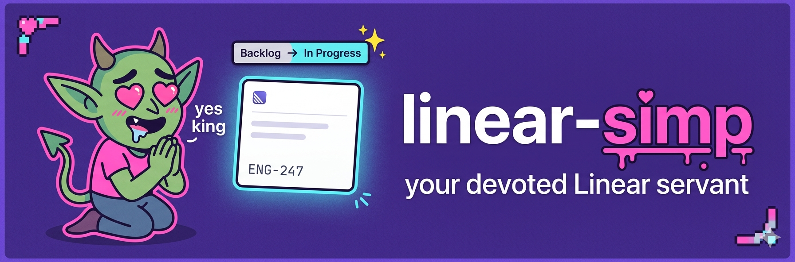

# linear-devotee



Linear workflow plugin for Claude Code and Codex.

It turns Linear issues and specs into SDD-shaped context, acceptance-traceable implementation plans, dependency-aware next-work recommendations, and gated Linear project/milestone/issue creation. Full cascades approve complete issue bodies—not title placeholders—before the first Linear mutation.

## Skills

| Skill                             | Purpose                                                                                                                  |
| --------------------------------- | ------------------------------------------------------------------------------------------------------------------------ |
| `linear-devotee:greet`            | Detect a Linear issue, load context, optionally prepare branch/status, then hand off to planning                         |
| `linear-devotee:plan`             | Write and validate an implementation plan, detect spec drift, and sync accepted drift after approval                     |
| `linear-devotee:next-issue`       | Recommend the next startable issue in the same Linear project after an issue is finished                                 |
| `linear-devotee:create-project`   | Draft complete `AC-###`-traceable issue packets + dependency graph, preview them, then create the cascade after one gate |
| `linear-devotee:create-milestone` | Add or resume the next milestone in a project cascade                                                                    |
| `linear-devotee:create-issue`     | Add or resume an SDD issue; source criteria use `AC-###`, autonomous criteria use `AC-L###`                              |

## Agents

| Agent               | Purpose                                                                            |
| ------------------- | ---------------------------------------------------------------------------------- |
| `issue-context`     | Read issue, comments, status, and referenced files into an SDD brief               |
| `plan-auditor`      | Compare plan, issue/spec, and exhaustive Acceptance coverage before implementation |
| `project-drafter`   | Draft project SDD, milestones, and approval-ready issue packets with dependencies  |
| `milestone-drafter` | Draft a milestone name, scope, target-date hint, and suggested issues              |
| `issue-drafter`     | Draft strict SDD issue bodies                                                      |

All Linear writes stay in skills and require explicit user confirmation. Agents are scouts/drafters, not Linear mutators.

## Native Linear coding sessions

Linear Agent can run Claude Code or Codex from an assigned issue and return a diff for review. Issues created by this plugin are ready for that path because their approved body already carries goal, constraints, files, stable source `AC-###` or issue-local `AC-L###` criteria, non-goals, and blockers. `linear-devotee` does not auto-assign the issue or start a cloud session; the user keeps that external mutation gate. See [Linear coding sessions](https://linear.app/changelog/2026-06-11-coding-sessions).

## Install

Claude Code:

```text
/plugin marketplace add g-bastianelli/nuthouse
/plugin install linear-devotee@nuthouse
```

Codex CLI:

```text
codex plugin marketplace add g-bastianelli/nuthouse
```

Then open `/plugins` and install `linear-devotee`.

## Layout

```text
linear-devotee/
  assets/
  persona.md
  shared/
  skills/
  agents/
  hooks/
    hooks.json
  claudecode/
    hooks/
    lib/
    tests/
```
