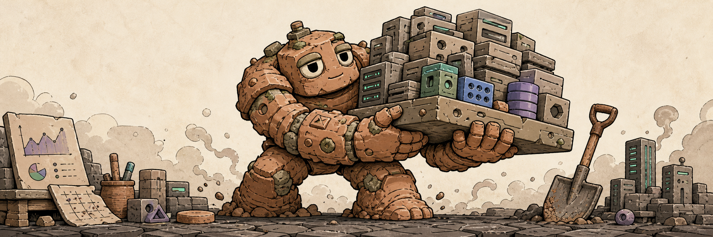

# stack-golem



> Clay-and-config colossus that hauls your notom stack by hand

A living artifact of configuration and persistence — the stack-golem inspects before it acts,
digs through logs with patient certainty, verifies the platform state layer by layer, and hauls
your notom infrastructure back upright when things go wrong. Never punts to the console. Built
on `scw` CLI, Scaleway observability, local dev debugging, and Insomnia collection sync.

## Install

### Claude Code

```
/plugin install stack-golem@nuthouse
```

### Codex CLI

```
codex plugin install stack-golem@nuthouse
```

## Skills

| Skill              | What it does                                                                                |
| ------------------ | ------------------------------------------------------------------------------------------- |
| `debug-local`      | Investigate local dev failures (env vars, Docker, Authentik/OIDC) — fixes before asking     |
| `observe-platform` | Query Loki logs & Prometheus metrics on Scaleway staging/prod; SSH into Authentik VMs       |
| `drive-scaleway`   | Drive the `scw` CLI for IAM, instances, databases, registry, networking — read before write |
| `sync-insomnia`    | Add/modify/remove API endpoints in Insomnia collections; commit via Git Sync                |

## Agents

| Agent | Used by | Role |
| ----- | ------- | ---- |

## License

MIT
