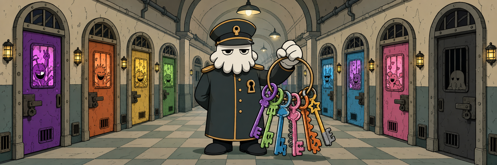

# warden



Shared voice gate for nuthouse plugins.

It centralizes decorative persona lines and gives the user one global on/off switch. If warden is missing or disabled, callers print nothing and continue normally.

## Skill

| Skill | Purpose |
|---|---|
| `warden:voice` | Toggle fun messages on/off/status, or dispatch one strict JSON persona line for Codex callers |

## Agent

| Agent | Purpose |
|---|---|
| `voice` | Claude Code dispatcher that reads a caller persona contract and returns one decorative line |

## Contract

Callers may try `warden:voice` at user-visible workflow transitions only: skill start, context resolved, user decision point, external mutation gate, handoff, recoverable failure, final report, and clean exit.

Never put persona lines into specs, plans, Linear descriptions, commit messages, PR bodies, or state files.

## Install

Claude Code:

```text
/plugin marketplace add g-bastianelli/nuthouse
/plugin install warden@nuthouse
```

Codex CLI:

```text
codex plugin marketplace add g-bastianelli/nuthouse
```

Then open `/plugins` and install `warden`.

## Usage

```text
/warden:voice on
/warden:voice off
/warden:voice status
```

Codex uses the same actions through `$warden:voice`.
